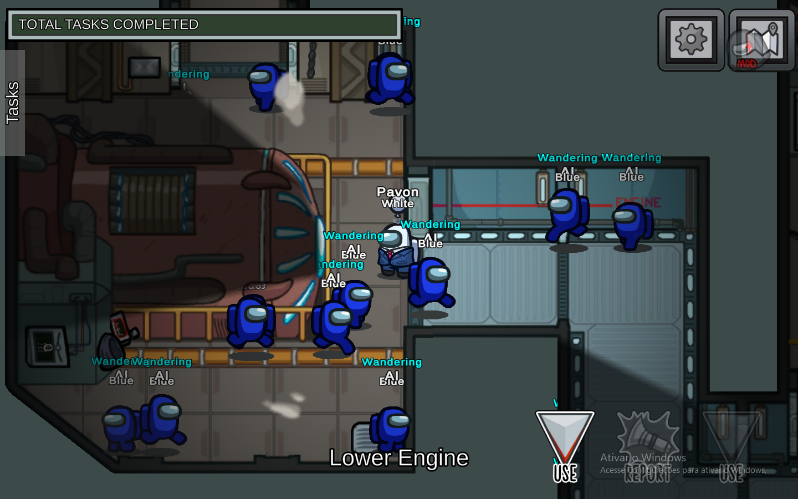
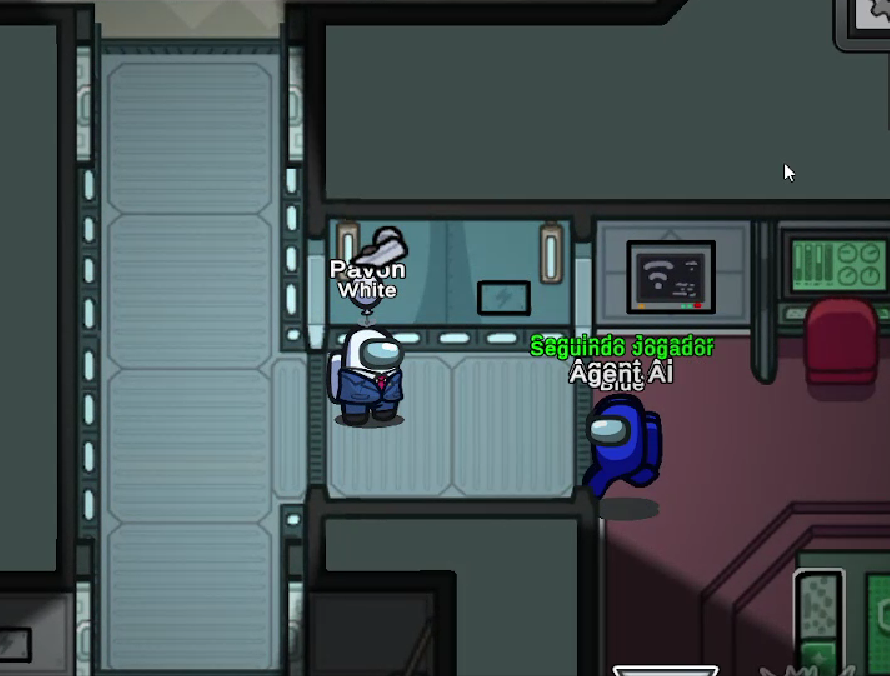

# AmongUsAIAgent

This is an AI Agent project that simulates multiple agents playing Among Us at the same time.

---

## First Step

The first challenge was finding a way to spawn agents on the map.

Fortunately, it wasn't that difficult. I simply instantiated a new `PlayerControl` and added it to the player list:

```cs
PlayerControl agentComponent = Object.Instantiate(AmongUsClient.Instance.PlayerPrefab);

agentComponent.PlayerId = (byte)(100 + Agents.Count);
agentComponent.NetId = (uint)(100 + Agents.Count);

ClientData localClient = AmongUsClient.Instance.GetClient(AmongUsClient.Instance.ClientId);
if (localClient != null)
{
    GameData.Instance.AddPlayer(agentComponent, localClient);
}
agentComponent.gameObject.AddComponent<AgentBrain>();
```

> This is not the full code, only a simplified version.

---

## Making the Agents Walk

This part was much harder.

I tried several approaches. At first, I thought about manually creating points that agents could walk to, or recording points while walking around the map myself.

Eventually, I found a better solution.

I spawned many agents and let them wander around the map while recording their positions. Using that data, I managed to map the entire Skeld.

After that, I implemented the A* algorithm for pathfinding.

However, there was a problem: agents kept getting stuck in narrow corners.

To solve this, I reduced the connection radius from `0.75` to `0.68`, preventing some problematic points from becoming neighbors.

```cs
float connectionRadius = 0.68f;
```

I also implemented obstacle avoidance so agents could escape when they got stuck.

<table>
<tr>
<td align="center">

<br>
Map tracking
</td>

<td align="center">

<br>
Stuck Agent
</td>
</tr>
</table>

---

## Making the Agents Do Tasks

Compared to pathfinding, this part was simple.

For now, agents receive random tasks. They walk to the task location, stop there, and wait until the task cooldown finishes.

It is not a perfect simulation yet, but it works well enough for testing.

---

## Reacting to Dead Bodies

When an agent finds a dead body, it has to make a decision:

* Report immediately?
* Look around for more information?

After evaluating the situation, the agent chooses one of these options.

If it decides to report, it simply reports the body.

If it decides to investigate, it searches nearby locations first.

To find those locations, I generate a circle around the body with a radius of 7 meters, remove invalid positions and positions too close to the agent, then select the most interesting points and send the agent there.

---

## Current Goal

Make the agents play normally.
